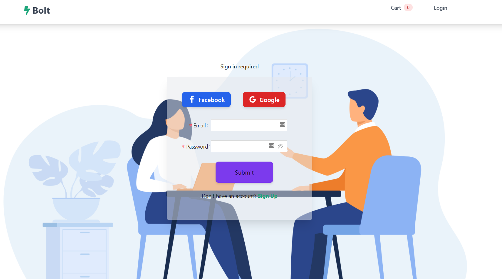
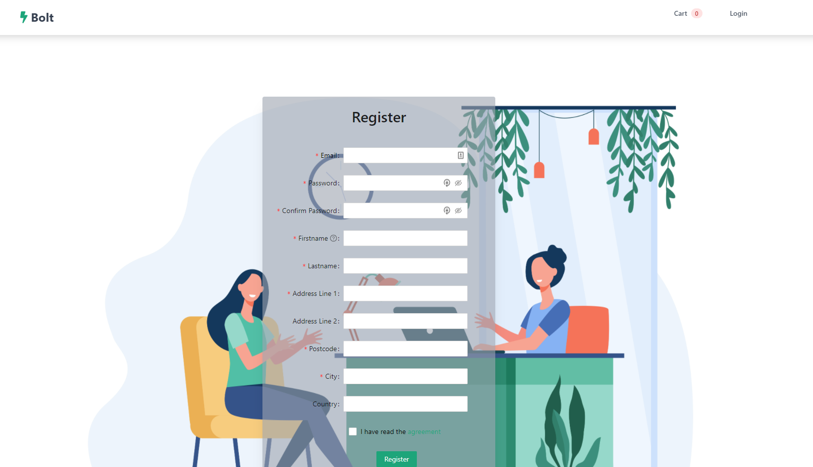
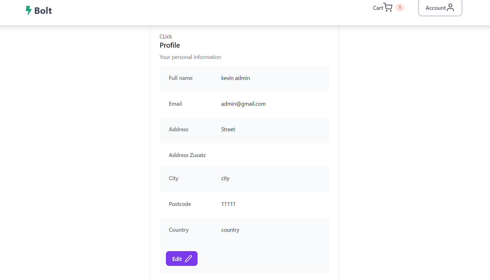
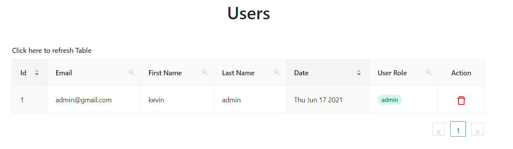
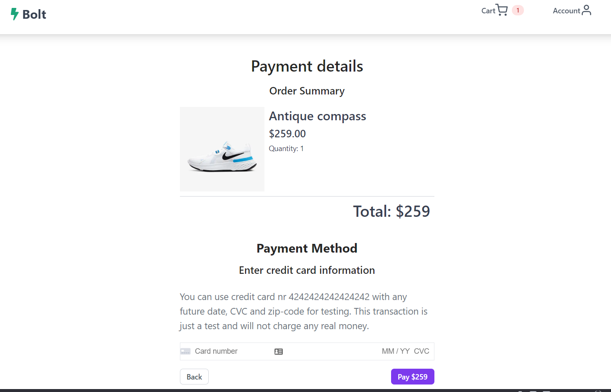
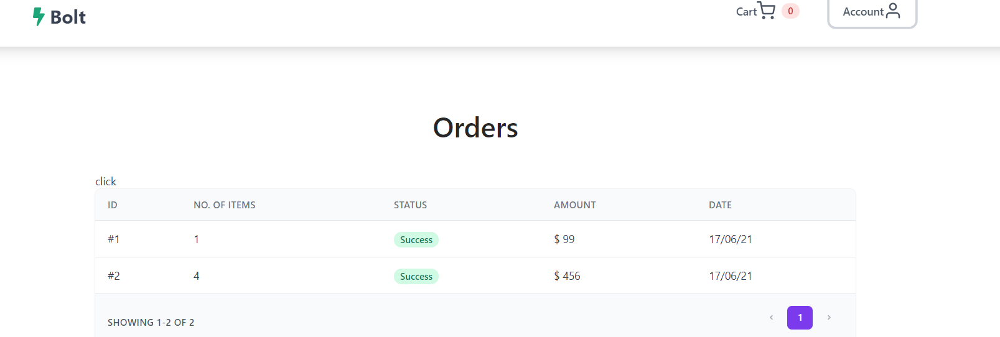
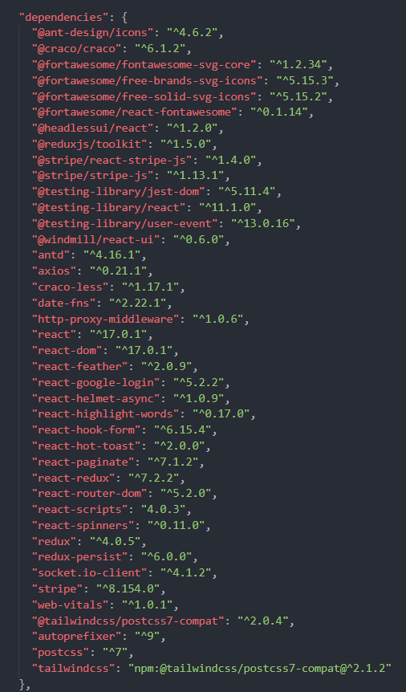
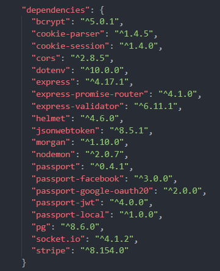

# Bolt Store 🏪

A small full-stack e-commerce project built with Postgres, Express, React and Node.

## [Click here to try out the current live version](bolt-store-deploy.herokuapp.com/)

<!-- TABLE OF CONTENTS -->

## :ledger: Index

<details open="open">
  <summary>Table of Contents</summary>
  <ol>
    <li>
      <a href="#beginner-features">Features</a>
    </li>
    <li>
     <a href="#hammer-built-with">Built With</a>
    </li>
    <li>
      <a href="#zap-getting-started">Getting Started</a>
      <ul>
        <li><a href="#notebook-pre-requisites">Pre-Requisites</a></li>
      </ul>
          <ul>
        <li><a href="#electric_plug-installation">Installation</a></li>
      </ul>
    </li>
    <li><a href="#fire-contributing">Contributing</a></li>
  </ol>
</details>

## :beginner: Features
- **User can Login with normal email/password or using Oath2**
 

- **User can register**
 

- **User can edit personal Information**
 
 
- **User can manage admin dashboard, delete user, sort user,... Only admin can access this page**
 

- **User can add to cart, view cart, checkout using stripe payment**
  
  
- **All orders are saved**
   

## :hammer: Built With
Postgres, Express, React and Node

<!-- GETTING STARTED -->

## :zap: Getting Started

### Prequesites 

### :notebook: Pre-Requisites
- **Frontend**
 
 
- **Backend**

  

### :electric_plug: Installation

Clone the project

```bash
  https://github.com/dkevin96/ecom-shop.git
```

Go to the project directory

```bash
  cd ecom-shop
  cd server 
  cd server/client
```

Install dependencies ( in server-, client-directory) 

```bash
  yarn install
```

Start the client ( in server-, client-directory) 

```bash
  yarn run
```

## Environment Variables

To run this project, you will need to add the following environment variables to your .env file

### server/.env

`DB_USER`

`DB_PASSWORD`

`DB_HOST`

`DB_PORT`

`DB_DATABASE`

`PORT`

`STRIPE_KEY`

`GOOGLE_CLIENT_ID`

`GOOGLE_CLIENT_SECRET`

`FACEBOOK_CLIENT_ID`

`FACEBOOK_CLIENT_SECRET`


<!-- CONTRIBUTING -->

## :fire: Contributing

Contributions are what make the open source community such an amazing place to be learn, inspire, and create. Any contributions you make are **greatly appreciated**.

1. Fork the Project
2. Create your Feature Branch (`git checkout -b feature/AmazingFeature`)
3. Commit your Changes (`git commit -m 'Add some AmazingFeature'`)
4. Push to the Branch (`git push origin feature/AmazingFeature`)
5. Open a Pull Request
